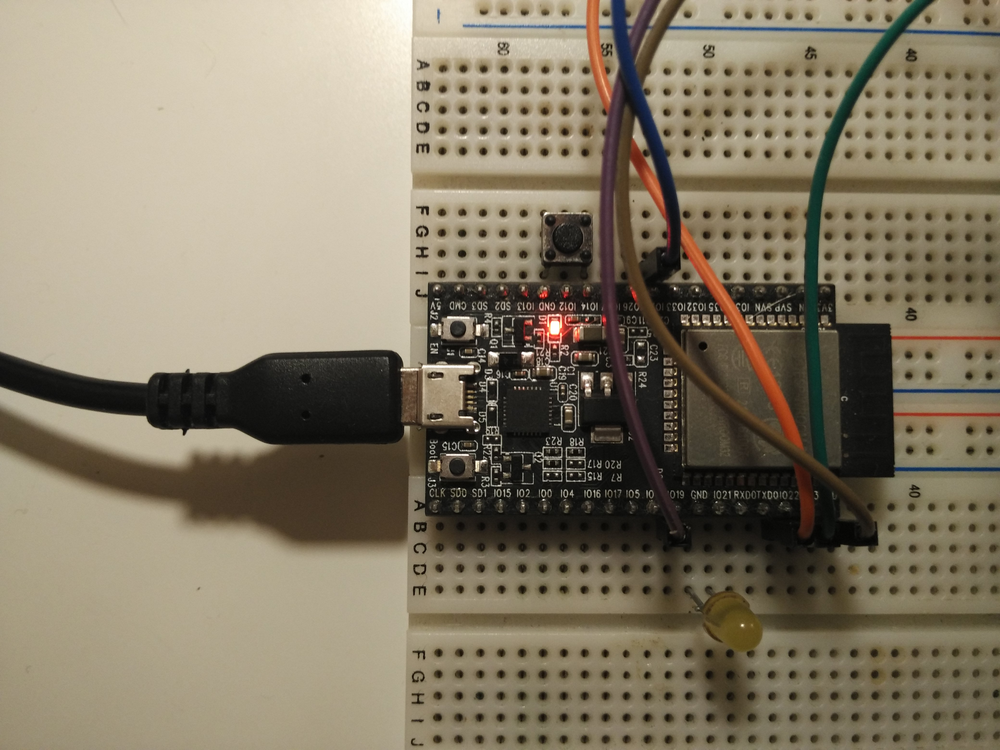

## Install and build

##### 1. Virtual machine installation
---

1. Get VirtualBox package from official [Downloads](https://www.virtualbox.org/wiki/Downloads) page.
Version 5.1.22 is known to be working.

2. Install VirtualBox Extension Pack appropriate to your version.

3. Download and use [VDI image](https://drive.google.com/open?id=0B5Q2K4xNERwCcFUzeUt6MHNFa2s) that contains all necessary tools.


`user password`: 123456


##### 2. Boards connection to PC
---

Current instruction made in assumption there's a 2 boards: 

[STM32F0DISCOVERY](http://www.st.com/en/evaluation-tools/stm32f0discovery.html)
 and 
[ESP32-DevKitC](https://espressif.com/en/products/hardware/esp32-devkitc/overview)

1. Connect both boards via USB cables to PC.

2. Launch VirtualBox and go to Settings -> USB.

3. Enable the checkbox "Enable USB Controller"

4. Enable the radiobutton "USB2.0 (EHCI) Controller"

If you don't want to throw USB inside VirtualBox everytime you launch it, then 

click on the green plus sign on the right side and choose the following:

    STMicroelectronics STM32 STLink
    Silicon Labs CP2102 USB to UART Bridge Controller
    

##### 3. Updating sources
---
Provided VDI image already has ECS repo cloned into /home/user/ECS.

If you want to clone in another place, then

```bash
git clone https://gitlab.com/eptecon/ECS <another_name>
```

In other case, you just need to go into cloned ECS directory

```bash
cd /home/user/ECS
```

and update it

```bash
git pull
```

##### 4. Build the firmwares
---

To build the firmware files, run
```bash
make
```

##### 5. Boards SPI connection
---

Boards should be connected accoring to the scheme below:

| SPI pin assignment | ESP32 board pin  | STM32F0DISCOVERY pin|
| ------------------ | ---------------- | -----------------   |
| MISO               | IO25             |  PB14               |
| MOSI               | IO23             |  PB15               |
| SCK                | IO19             |  PB13               |
| CS                 | IO22             |  PB12               |


##### 6. Button and LED connection
---

An external button and LED is used as a simple HMI.

The long button press on ESP32 startup launches the HTTP server to launch the 
WiFi credentials.

LED indicating the current device mode:

| LED mode          |Meaning                          |
| ----------------- | ------------------------------- |
| Turns on          | Device initialized successfully |
| Blinking fast     | HTTP server starts              |
| Blinking slowly   | Connects to AWS successfully    |


LED should be connected with its anode to IO21 and cathode to GND (it's adjactent pins)
Button should be conneted to IO14 and GND.




##### 7. Boards flashing
---

To flash the boards you will need to go into *scripts* directory:
```bash
cd scripts
```

There you will find a bunch of useful scripts, but we'll need just few of them now.

To flash ESP32 board, run

```bash
./esp32_flash_all.sh /dev/ttyUSB0
```
`note:` in most cases your port will be /dev/ttyUSB0. If not - change to appropriate one.

Please notice, that connection to AWS IoT service requires a valid certificate set.
The certificates are passed to ESP32 through settings JSON file.
To make a first steps easier, there's a ready to use settings file named
*settings.json*

To generate your own certificates in settings, you should run *certs_to_settings.py* script:
```
certs_to_settings.py <root CA> <private key> <client cert> <settings file>
```
For example:
```
certs_to_settings.py ../common/certs_ad67677359/root_CA.pem ../common/certs_ad67677359/ad67677359-private.pem.key ../common/certs_ad67677359/ad67677359-certificate.pem.crt settings.json
```

To flash settings file, run:
```
./esp32_flash_settings.sh /dev/ttyUSB0 <your settings file>
```


To flash STM32 board, run

```bash
./stm32_flash.sh
```

